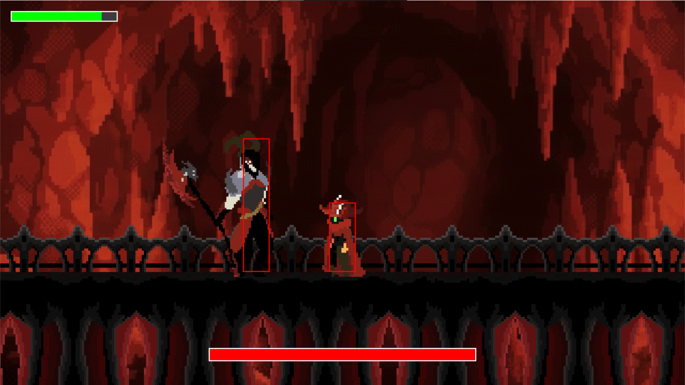

#  [Into the ayss]

> Un juego de acción y plataformas 2D estilo "Boss Rush" desarrollado en Python.


## Descripción

Este proyecto es un videojuego de combate desarrollado como Proyecto Final para el curso de **Computación y Programación** de lic. en física en la **Universidad de Chile**. Implementa un motor de juego modular basado en **Pygame**, destacando el uso de **programación orientada a objetos**, **máquinas de estados finitos** para la IA y **física de colisiones precisa**.

El jugador controla a un héroe que debe enfrentarse a **"Pancho" (Inspirado en un profesor)**, un jefe final con 2 fases de ataque y comportamientos inteligentes.

---

## Características Principales

*  **Sistema de Combate Fluido:** Combos de 3 golpes, sistema de *dash* (esquiva) y *hitboxes* precisas separadas de los sprites visuales.
* **IA de Jefe Avanzada (FSM):** El jefe "Pancho" utiliza una Máquina de Estados Finitos para decidir entre perseguir, atacar cuerpo a cuerpo, lanzar proyectiles o recuperar su arma.
* **Mecánica de Parry:** Posibilidad de golpear los proyectiles enemigos para desviarlos y dañar al jefe (estilo *Ping-Pong(desarrollo)*).
* **Arquitectura Modular:** Código organizado en Escenas (`Scene Manager`) y Entidades (`Entity Component`), facilitando la escalabilidad.
* **Feedback Visual:** Barras de vida dinámicas, animaciones de estados y efectos de empuje (*knockback*).

---

## Controles

| Acción | Tecla | Descripción |
| :--- | :---: | :--- |
| **Moverse** | `Flechas` | Mover izquierda/derecha |
| **Atacar** | `Z` | Combo de espada (x3) |
| **Saltar** | `X` | Salto simple |
| **Dash** | `C` | Esquiva rápida e invulnerabilidad |
| **Pausar/Salir** | `ESC` | Volver al menú |
| **Reiniciar** | `ENTER` | En pantalla de Game Over |

---

##  Instalación y Ejecución

Sigue estos pasos para probar el juego en tu computadora:

### 1. Clonar el repositorio
```bash
git clone https://github.com/Layex14/Proyecto-pinguino.git
cd Proyecto-Final
```
### 2. Instalar dependencias
Es necesario tener **Python** instalado. Se recomienda usar un entorno virtual.
```bash
pip install -r requirement.txt
```
### 3. Ejecuta el juego
```bash
python principal.pyw
```

## Estructura del proyecto


Proyecto-Final/
│
├── principal.pyw       # Entry Point: Bucle principal y Gestor de Escenas
├── configuracion.py    # Constantes globales (Pantalla, FPS, Colores)
│
├── escenas/            # Lógica de las pantallas
│   ├── Juego.py        # Motor del nivel, colisiones y UI
│   └── menuprincipal.py
│
├── entidades/          # Clases de objetos de juego
│   ├── Entity.py       # Clase Padre (Física, Animación, Hitboxes)
│   ├── boss.py         # Lógica específica e IA del Jefe
│   └── pancho_config.py # Datos de configuración y balanceo
│
└── recursos/           # Assets (Imágenes y Música)

## Autores
Martín Gonzalez- Creador de: Hitbox, Ataques, Vida, parry, estructura modular, administrador de escenarios, botones, pantalla de Derrota y Victoria y el entorno en Github.

Kevin Egoavil- Creador de: Todo el arte visual, Gravedad, movimiento y animaciones de entidades, diccionario de variables, introducción del combate, el pinguino de Victoria y cámara dinamica.

Benjamín Alfaro- Creador de: Musica, IA del Jefe y ataques del jefe (Melee y Throwing)


